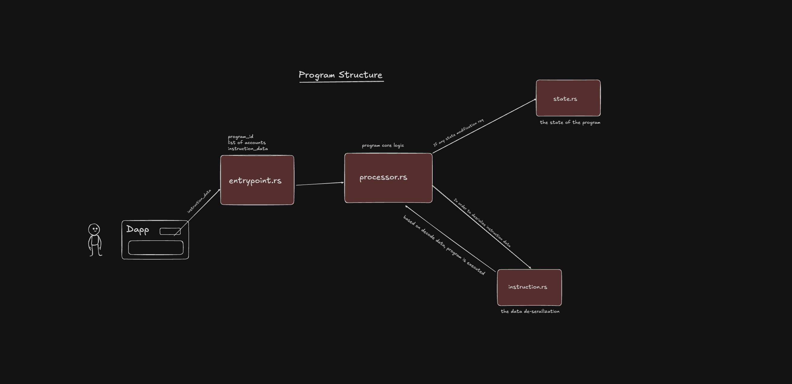

### Environment Setup
1. Install Rust from https://rustup.rs/
2. Install Solana from https://docs.solana.com/cli/install-solana-cli-tools#use-solanas-install-tool


### Structure of the Program
```
.
├─ src
│  ├─ lib.rs -> registering modules
│  ├─ entrypoint.rs -> entrypoint to the program
│  ├─ instruction.rs -> program API, desreailze
|  |                    instruction data
│  ├─ processor.rs -> program logic
│  ├─ state.rs -> program objects, (de)serializing
|  |              state
│  ├─ error.rs -> program specific errors
```

### How Actually Programs Works

#### The flow of a program using this structure looks like this:

1. Someone calls the entrypoint.
2. The entrypoint forwards the arguments to the processor.
3. The processor asks instruction.rs to decode the instruction_data argument from the
   entrypoint function.
4. Using the decoded data, the processor will now decide which processing function to
   use to process the request.
5. The processor may use state.rs to encode state into or decode the state of an
   account which has been passed into the entrypoint.


### Project File architecture :



### Build and test for program compiled natively
```
$ cargo build
$ cargo test
```

### Build and test the program compiled for BPF
```
$ cargo build-bpf
$ cargo test-bpf
```
